# GuideSamples project for Ubuntu build and debug
- **Dali** Ubuntu build and **tizenfx-stub** Ubuntu build should be done(be set up) before running this project.
- Please check this references first : [NUI Ubuntu guide](https://code.sec.samsung.net/confluence/display/GFX/NUI+running+on+Ubuntu+backend), [DALi Ubuntu guide](https://code.sec.samsung.net/confluence/display/GFX/DALi+Getting+Started+Guide)

### nuget.config
- Please check the ~/.nuget/NuGet/NuGet.Config file to set nuget package sources.
- At least, these 2 sources should be included : https://tizen.myget.org/F/dotnet/api/v3/index.json, https://api.nuget.org/v3/index.json
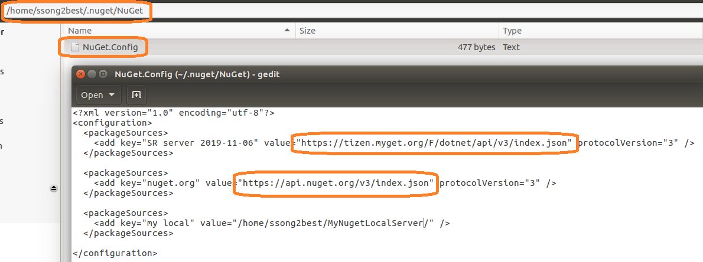

### VS Code related setting
- Please change the paths shown blow as for your environment.
- .vscode/launch.json
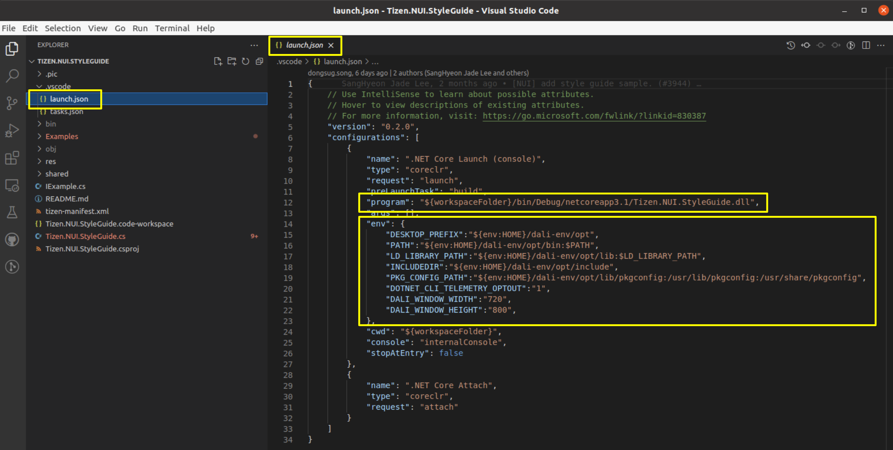

### csproj file
- Set the target framework installed in your environment.
- GuideSamples.csproj
- Please check .NET version like below. Should be 3.1 version.
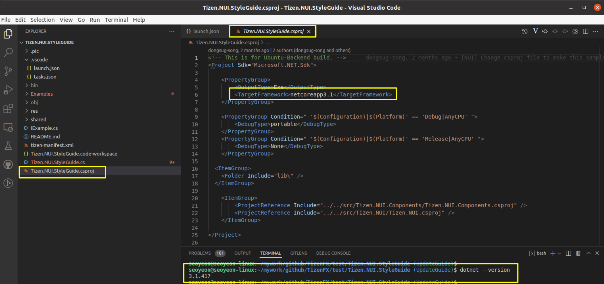

### Start debugging
- Open VS Code by the command, **"$ code GuideSamples.code-workspace"** in /TizenFX/test/GuideSamples/ folder.
- Do run and debug by clicking "play button" as shown below
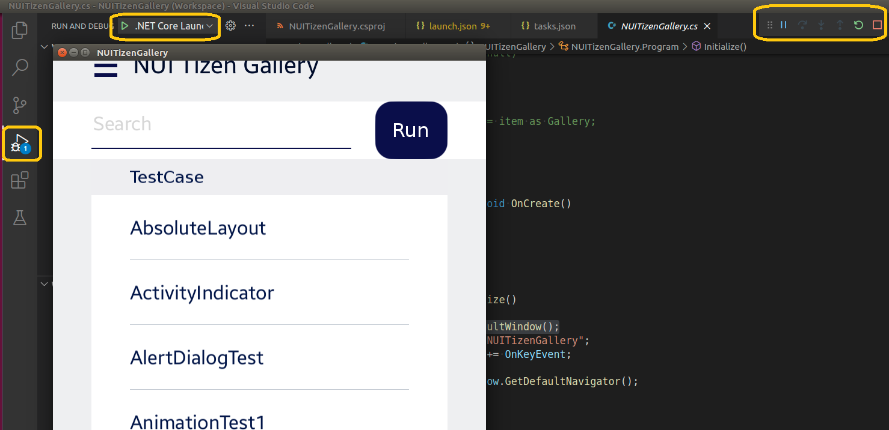

## Components

### Main view and Filter

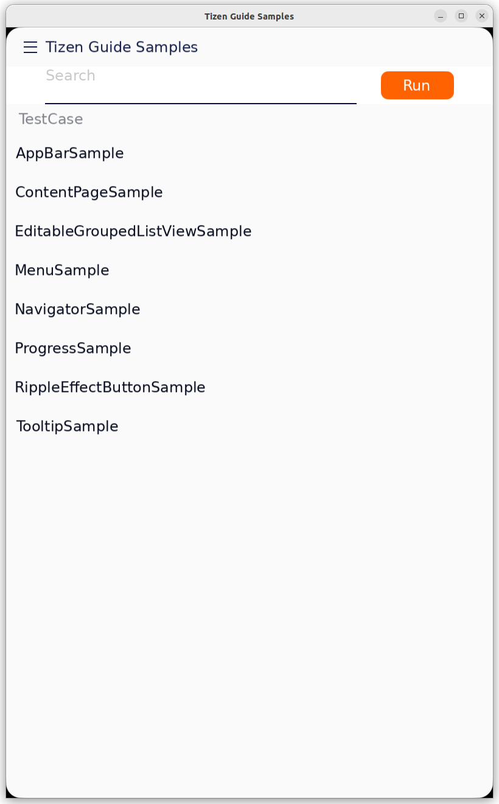{: width="300" height="482"}
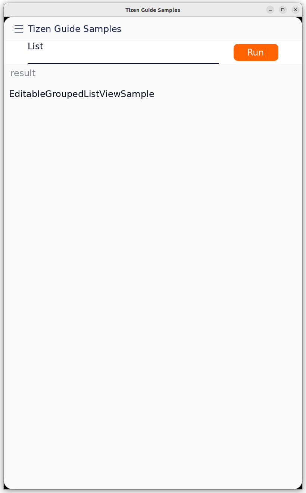{: width="300" height="482"}
- The main page is collectionView which connected each samples. it also provide search field which can filter the list.

### ListView
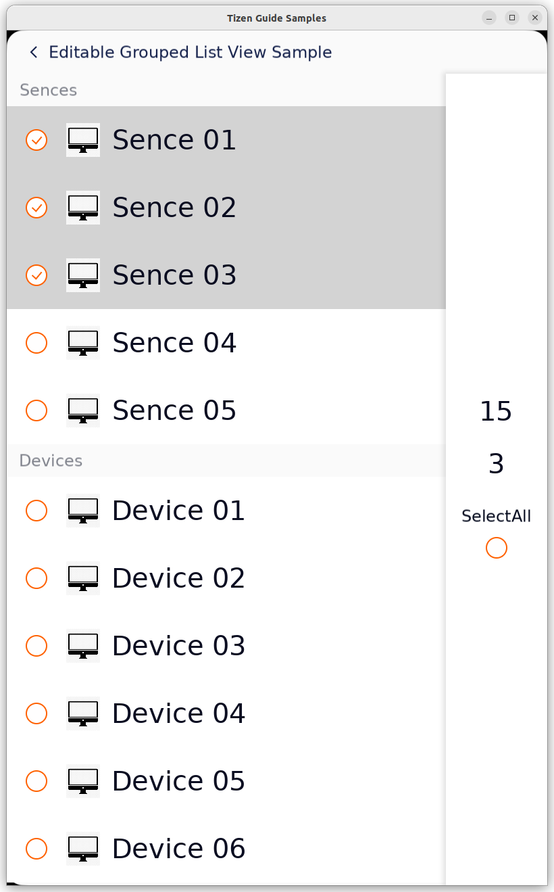{: width="300" height="482"}
- ListView with edit mode. see the code in (./Samples/EditableGroupedListViewSample.cs)
- CollectionView is scrollable items view with source data. It generate items via DataTempalte and reuse on scroll movement with binding data, so you can efficently manage the memory resource.
- In the sample, 3 data class is exist. Device is primitive device data class which holding DeviceName and IsSelected property. to update binded view when data changes, please implements INotifyPropertyChanged.
- DeviceGroup is ObservableCollection of Device. it also have its own property for SelectCount and SelectAll.
- DeviceGroups is ObservableCollection of DeviceGroup. this will be the source of collectionView.
- DeviceItem will be bound Device data internally, and TitleItem will be bound DeviceGroup internally. Text and Image, IsSelected property is bounded property of data.
- SelectAll checkbox is bounded DeviceGroups who can check selected all items. when it clicked, you may need to update device SelectAll property and CollectionView Selection List manually.

### Menu
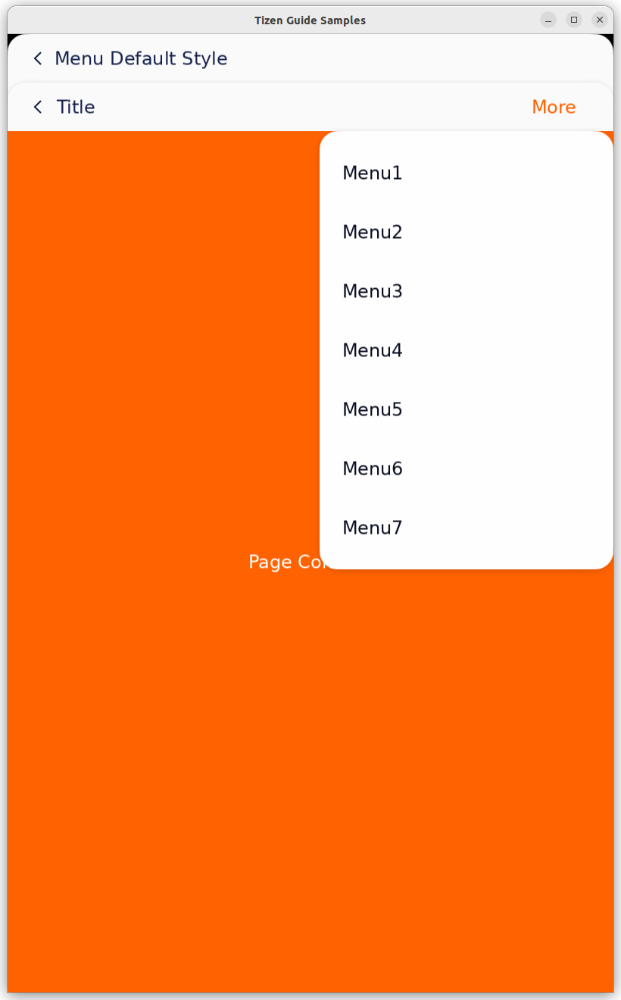{: width="300" height="482"}
- Menu class is the anchor based dialog which holding a list internally. you and add items when it created. see the code in (./Samples/MenuSample.cs)
- if you set Menu size manually, if internal items length is bigger than menu size, scroll is automatically activated.
- currently menu only provide Anchor on object with Start, Center, End of Vertical and Horizontal axis. we are working on adding anchor on position.

### Progress
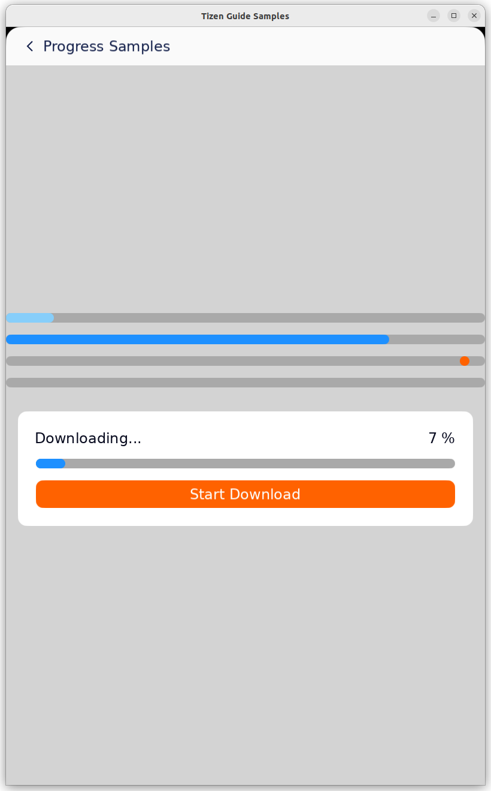{: width="300" height="482"}
- Progress class sample.  see the code in (./Samples/ProgressSample.cs)
- Progress property is not animatable. I add how to use Timer instead of animation.

### Button
### Progress
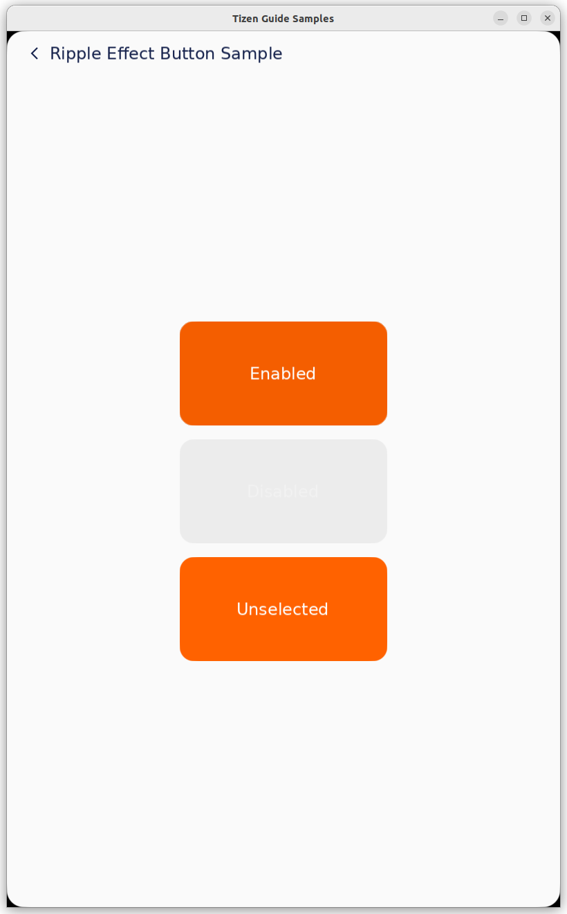{: width="300" height="482"}
- Button class with custom style of Rippled-Circle effect. see the code in (./Samples/RippleEffectButtonSample.cs)
- It has own style with extension and the circle Overlay Image is animated when it clicked. Check OnControlStateChanged of OverlayAnimationButtonExtension for the details.

### Tooltip
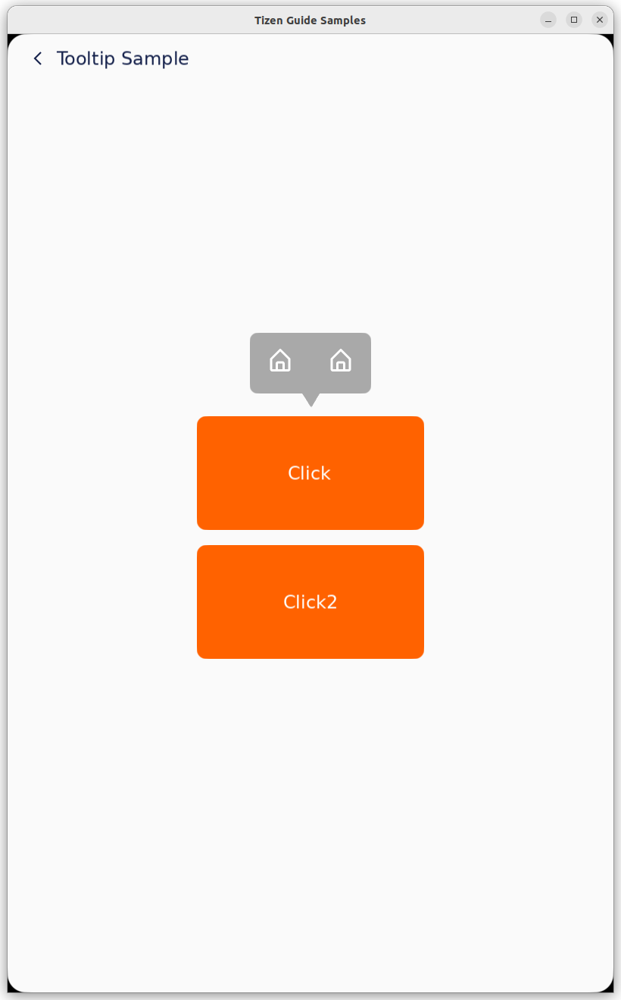{: width="300" height="482"}
- NUI do not have tooltip component. this is guide of creating tooltip with using menu. see the code in (./Samples/TooltipSample.cs)
- Menu have vertical scrolalbleBase as content but here we change it to Horizontal Layout view.
- please change tail iamge on actual UI resource.

### Others
- NUI use Navigator and Page for default page navigation system.
- other samples are regarding how to use navigator and ContentPage and Appbar.
- you can find more samples about Dialog, TabBar, Radio, Check, Toogle and ScrollableBase in NUITizenGallery(./test/NUITizenGallery) and Tizen.NUI.StyleGuide(./test/Tizen.NUI.StyleGuide).